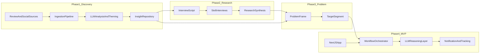
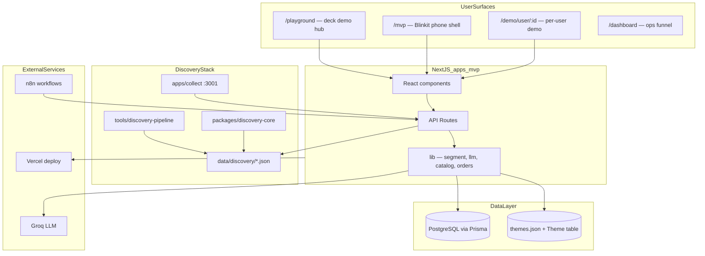
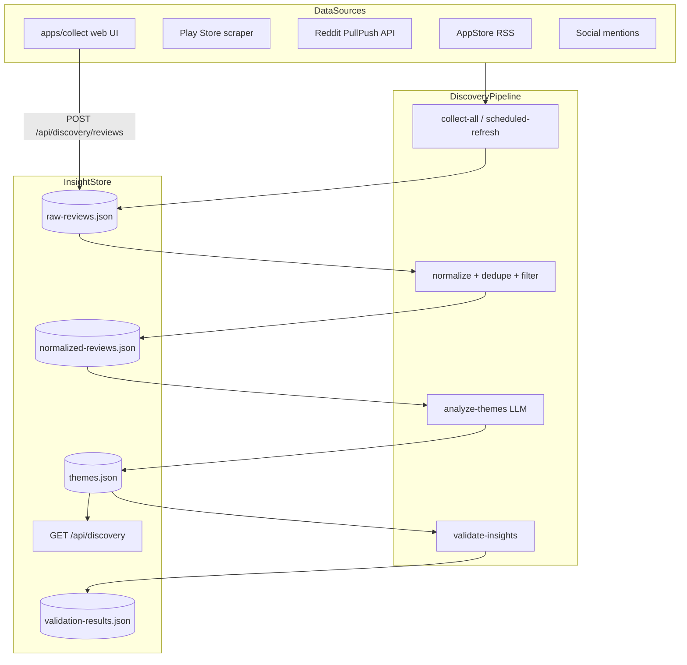
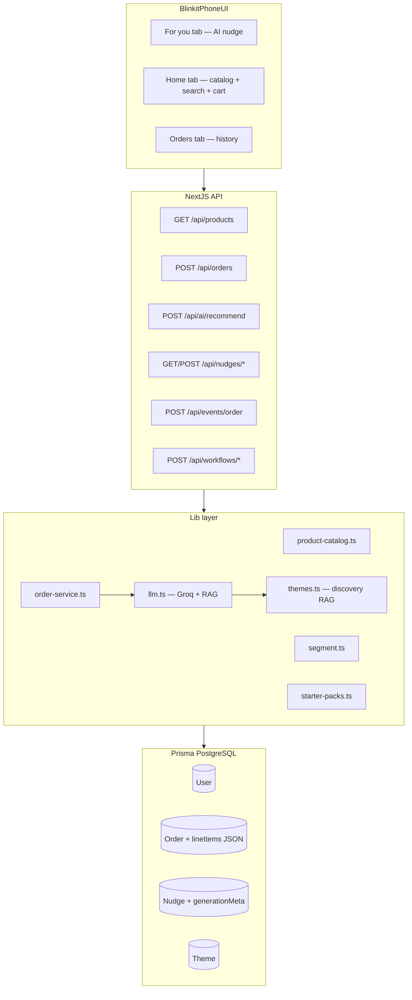
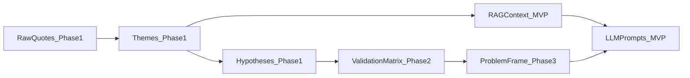

# Architecture: Smart Category Explorer

> **Submission deck:** [Blinkit.pdf](./Blinkit.pdf) · **Alignment:** [DECK_ALIGNMENT.md](./DECK_ALIGNMENT.md) · **Production URLs:** [PRODUCTION.md](./PRODUCTION.md) · **Problem frame:** [problemstatement.md](./problemstatement.md)

## North-star metric and success criteria

**Business goal:** Increase % of Monthly Active Customers (MAC) who purchase from at least one **new category** each month.

**Deck targets (two quarters):** +20% category exploration · +15% AOV · +18% recommendation CTR · +10% retention.

**Architecture principle:** Each phase produces structured artefacts that feed the next — raw feedback → themes → validated hypotheses → problem statement → Smart Category Explorer MVP.



---

## As-built system overview

The monorepo is **implemented end-to-end**: discovery pipeline, research/problem showcases, Blinkit-style MVP phone UI, REST APIs, PostgreSQL persistence (Prisma), Groq LLM nudges, n8n workflow contracts, and Vitest unit tests.



| Layer | Technology |
|-------|------------|
| **Frontend** | Next.js 15, React 19, TypeScript |
| **API** | Next.js App Router route handlers, Zod validation |
| **Database** | PostgreSQL + Prisma 6 (`apps/mvp/prisma/`) — Neon or Supabase |
| **LLM** | Groq (`llama-3.3-70b-versatile`) via OpenAI SDK; OpenAI fallback |
| **Discovery** | `@blinkit/discovery-core`, `tools/discovery-pipeline`, `data/discovery/` |
| **Orchestration** | n8n workflow JSON in `workflows/`; optional GitHub Actions scrape |
| **Testing** | Vitest 3 — `tests/mvp/`, `tests/discovery/` |
| **Deploy** | Vercel (`category-explorer-mvp`) |

---

## Monorepo layout (as built)

```
GrauationProject2/
├── apps/
│   ├── mvp/                     # Main app — playground, MVP phone, APIs (:3000)
│   │   ├── app/                 # Pages + API routes
│   │   ├── components/          # Blinkit UI, showcases, nudge cards
│   │   ├── lib/                 # Business logic (llm, segment, catalog, orders)
│   │   └── prisma/              # Schema, migrations, seed
│   └── collect/                 # Phase 1a: manual review ingest UI (:3001)
├── packages/
│   └── discovery-core/          # Shared types, normalize, path helpers
├── tools/
│   └── discovery-pipeline/      # Scrapers, theme extraction, validation CLI
├── data/
│   └── discovery/               # Generated artefacts (raw, themes, validation)
├── tests/
│   ├── mvp/unit/                # MVP unit tests (segment, catalog, schemas)
│   └── discovery/unit/          # discovery-core normalize tests
├── workflows/                   # n8n export JSON + webhook contracts
├── scripts/                     # setup, deploy, scheduled scrape helpers
├── docs/                        # architecture, deck, research, production
│   └── deck/                    # Deck outline + 1-slider workflow
└── vitest.config.ts             # @mvp / @discovery-core path aliases
```

### Root npm scripts

| Script | Purpose |
|--------|---------|
| `npm run dev` | Start MVP app (`apps/mvp`, port 3000) |
| `npm run dev:collect` | Start collect UI (`apps/collect`, port 3001) |
| `npm run db:seed` | Seed demo users, orders, themes |
| `npm run backend:setup` | `prisma migrate deploy` + seed (PowerShell) |
| `npm run discovery:refresh` | Scrape → normalize → analyze → validate |
| `npm run discovery:scrape` | Scrape only |
| `npm test` | All unit tests (29) |
| `npm run test:mvp` | MVP tests only (25) |
| `npm run test:watch` | Vitest watch mode |

---

## Phase 1 — AI-Powered Discovery Engine

### Purpose
Answer *why* users repeat categories, *what* blocks exploration, and *which* segments experiment — using App/Play Store reviews, Reddit, forums, and social signals.

### As-built architecture



### Components (implemented)

| Component | Location | Responsibility |
|-----------|----------|----------------|
| **Collect UI** | `apps/collect/` | Paste reviews, CSV import, keyword tagging |
| **MVP discovery APIs** | `apps/mvp/app/api/discovery/` | Ingest, normalize, status, bundle output |
| **Scrapers** | `tools/discovery-pipeline/scrapers/` | App Store, Play Store, Reddit, merge |
| **Normalizer** | `packages/discovery-core/src/normalize.ts` | Dedupe, filter, chunk, pipeline stats |
| **Theme extractor** | `tools/discovery-pipeline/pipelines/analyze-themes.ts` | LLM structured theme extraction |
| **Validation pass** | `tools/discovery-pipeline/pipelines/validate-insights.ts` | Quote linkage + confidence rubric |
| **Research Q&A API** | `GET /api/research/questions` | Part 1 questions with evidence quotes |
| **Scheduled refresh** | `npm run discovery:refresh`, GitHub Actions, n8n | 12h scrape cycle |

### Discovery data artefacts (`data/discovery/`)

| File | Content |
|------|---------|
| `raw-reviews.json` | Unified raw review corpus |
| `normalized-reviews.json` | Cleaned, deduplicated reviews |
| `chunks.json` | Batched chunks for LLM analysis |
| `themes.json` | Extracted themes with representative quotes |
| `validation-results.json` | Validation pass outcomes |
| `pipeline-stats.json` | Run statistics |

### Discovery pipeline CLI (`tools/discovery-pipeline`)

| Script | Command |
|--------|---------|
| Scrape all sources | `npm run collect:scrape` |
| Full refresh (scrape + analyze + validate) | `npm run discovery:refresh` |
| Analyze themes only | `npm run pipeline:analyze` |
| Validate insights only | `npm run pipeline:validate` |
| Generate sample data | `npm run collect:sample` |

---

## Phase 2 — Primary User Research Validation

### Purpose
Validate or challenge AI themes with 5–6 interviews in the chosen segment.

### As-built (documentation + in-app showcase)

Phase 2 is primarily **artefact-driven** rather than a separate service:

| Artefact | Location |
|----------|----------|
| Research Q&A showcase | `apps/mvp/components/ResearchQAShowcase.tsx`, `/playground` |
| Survey evidence loader | `apps/mvp/lib/survey-evidence.ts` |
| Interview / validation docs | `docs/research/` (when present) |

The playground surfaces scraped quotes and survey evidence alongside Phase 1 themes via `GET /api/research/questions`.

---

## Phase 3 — Problem Definition

### Purpose
Synthesize Phase 1 + 2 into a crisp problem frame that drives MVP scope.

### As-built

| Surface | Location |
|---------|----------|
| Problem statement doc | `docs/problemstatement.md` |
| In-app problem frame | `apps/mvp/lib/problem-definition.ts` |
| API | `GET /api/problem-definition` |
| Playground showcase | `apps/mvp/components/ProblemDefinitionShowcase.tsx` |

**MVP segment rule (implemented):** All demo users are eligible for AI category recommendations unless `optedOut` is true (`apps/mvp/lib/segment.ts`). Order-history gates were removed so every persona can receive nudges in the demo.

---

## Phase 4 — Smart Category Explorer MVP

### High-level architecture (as built)



### Core workflow (happy path)

1. **User shops** on Home tab — browse 19-product catalog, search, add to cart (`BlinkitHomeCatalog.tsx`, `lib/product-catalog.ts`).
2. **Place order** — `POST /api/orders` with `lineItems` → persisted to `Order` (including `lineItems` JSON) → user stats updated.
3. **Segment check** — `matchesTargetSegment()` (opt-out only).
4. **LLM nudge** — Groq generates adjacent category + rationale + risk reducers using discovery themes as RAG (`lib/llm.ts`).
5. **Immediate delivery** — nudge shown on For you tab right after order (`SmartCategoryNudge.tsx`, `ForYouHighlight.tsx` on Home).
6. **Feedback** — accept creates starter-pack order via `placeStarterPackOrder()`; dismiss/snooze updates nudge status (`POST /api/nudges/:id/feedback`).
7. **Ops tracking** — funnel metrics on `/dashboard` via `GET /api/dashboard`.

**Alternate triggers:** n8n post-order webhook (`POST /api/events/order`), daily batch scan (`POST /api/workflows/scan-users`), manual generate (`POST /api/nudges/generate`, `POST /api/ai/recommend`).

### Pages and routes (`apps/mvp/app/`)

| Route | Role |
|-------|------|
| `/` | Redirects to `/mvp` |
| `/mvp` | Primary demo — Blinkit phone shell (`Part4MvpShowcase.tsx`) |
| `/playground` | Deck hub — discovery, problem, ops, MVP launch card |
| `/demo/user/[id]` | Per-user demo with switcher (Atharv, Amit, Raju, Sandy) |
| `/dashboard` | Ops funnel — eligible → nudged → accepted |
| `/dashboard/discovery` | Discovery pipeline status |
| `/discovery/part1` | Part 1 discovery showcase |
| `/discovery/part3` | Part 3 problem showcase |

### Key UI components (`apps/mvp/components/`)

| Component | Role |
|-----------|------|
| `BlinkitPhoneShell.tsx` | Phone frame, nav (For you \| Home \| Orders), search bar |
| `BlinkitHomeCatalog.tsx` | Product grid, category filters, cart |
| `DemoUserClient.tsx` | User state, order placement, nudge lifecycle |
| `SmartCategoryNudge.tsx` | AI recommendation card with accept/dismiss |
| `ForYouHighlight.tsx` | Home-tab teaser for AI picks |
| `OrderHistory.tsx` | Orders tab with line items |
| `OpsDashboardShowcase.tsx` | Playground ops section |
| `MvpLaunchHighlight.tsx` | Opens MVP in new tab from playground |
| `BackToTop.tsx` | Global scroll-to-top control |

### REST API catalogue

Full machine-readable index: `GET /api` (generated from `lib/api/catalog.ts`).

#### Discovery & research

| Method | Path | Auth | Description |
|--------|------|------|-------------|
| GET | `/api/discovery` | public | Themes, stats, validation bundle |
| GET | `/api/discovery/status` | public | Raw review count |
| POST | `/api/discovery/reviews` | webhook | Ingest reviews from collect/scrapers |
| POST | `/api/discovery/normalize` | webhook | Re-run normalize pipeline |
| GET | `/api/research/questions` | public | Research Q&A with evidence |
| GET | `/api/problem-definition` | public | Problem frame JSON |
| GET | `/api/workflows/discovery-refresh` | public | Last scrape report |
| POST | `/api/workflows/discovery-refresh` | webhook | Scrape completion callback |

#### MVP — catalog, orders, AI

| Method | Path | Auth | Description |
|--------|------|------|-------------|
| GET | `/api/products` | public | Catalog (`?q=` search, `?category=`) |
| GET | `/api/users` | public | Demo users + eligibility |
| GET | `/api/users/:id` | public | User profile, orders, nudges |
| GET | `/api/orders` | public | Order list (`?userId=`) |
| POST | `/api/orders` | public | Place order → LLM nudge |
| GET | `/api/nudges` | public | Nudge list (`?userId=`, `?status=`) |
| POST | `/api/nudges/generate` | webhook | Generate nudge for user |
| POST | `/api/nudges/:id/feedback` | public | accept / dismiss / snooze |
| POST | `/api/ai/recommend` | public | Standalone AI recommendation |
| GET | `/api/ai/status` | public | Groq/OpenAI readiness |

#### Ops & workflows

| Method | Path | Auth | Description |
|--------|------|------|-------------|
| GET | `/api/health` | public | DB, discovery, LLM health |
| GET | `/api/dashboard` | public | Funnel stats, recent nudges |
| GET | `/api/workflows` | public | n8n contract documentation |
| POST | `/api/events/order` | webhook | Post-order webhook (n8n) |
| POST | `/api/workflows/scan-users` | webhook | Daily batch nudge scan |

**Webhook auth:** `x-webhook-secret: <N8N_WEBHOOK_SECRET>` on protected routes (`lib/api/auth.ts`).

**Request validation:** Zod schemas in `lib/api/schemas.ts` (`placeOrderSchema`, `nudgeFeedbackSchema`, `generateNudgeSchema`, etc.).

### Database schema (Prisma + PostgreSQL)

```
User
  id, name, email, segmentTags (JSON), categoriesPurchased (JSON)
  orderCount, lastOrderAt, optedOut, createdAt
  → orders[], nudges[]

Order
  id, userId, items (JSON), categories (JSON), totalAmount
  lineItems (JSON, optional) — [{ productId, name, brand, quantity, unitPrice, lineTotal, category }]
  createdAt

Nudge
  id, userId, suggestedCategory, adjacentTo (JSON), copy, rationale
  riskReducers (JSON), confidence, evidenceThemeIds (JSON)
  status (pending | accepted | dismissed | snoozed)
  triggerType (post_order | batch_scan | manual)
  generationMeta (JSON, optional) — { provider, model, source, latencyMs }
  createdAt, respondedAt

Theme
  id, label, summary, quotes (JSON), confidence
```

**Seed data:** Four demo users (Atharv, Amit, Raju, Sandy) with distinct purchase patterns; themes synced from `data/discovery/themes.json` (`prisma/seed.ts`).

**Setup:** `npm run backend:setup` or `cd apps/mvp && npx prisma migrate deploy && npm run db:seed`.

### Lib modules (`apps/mvp/lib/`)

| Module | Responsibility |
|--------|----------------|
| `segment.ts` | Eligibility (opt-out only) |
| `llm.ts` | Groq/OpenAI client, structured nudge output, RAG context |
| `themes.ts` | Load discovery themes, social proof, adjacent category hints |
| `product-catalog.ts` | 19 products, search, cart resolution |
| `order-service.ts` | `placeOrderWithLlm()`, `placeStarterPackOrder()` |
| `starter-packs.ts` | Category trial packs (₹99) for accept flow |
| `discovery-service.ts` | Read/write discovery JSON, ingest helpers |
| `demo-users.ts` | Demo personas and basket patterns |
| `api/schemas.ts` | Zod API contracts |
| `api/auth.ts` | Webhook secret verification |
| `generation-meta.ts` | LLM provenance parsing |

### Product catalog

Static in-memory catalog (`lib/product-catalog.ts`) — **not** a full Blinkit clone, but enough for a credible demo:

- **19 products** across Groceries, Snacks & Beverages, Personal Care, Household Essentials, Pet Supplies, etc.
- **Search** by name/brand (`searchProducts`)
- **Cart → order** via `resolveCartLineItems` → `POST /api/orders`

### LLM design

**Provider priority:** Groq (`GROQ_API_KEY`) → OpenAI (`OPENAI_API_KEY`) → graceful degradation.

**Structured output schema** (`NudgeOutputSchema` in `lib/llm.ts`):

```typescript
{
  suggestedCategory: string,
  adjacentTo: string[],
  rationale: string,
  copy: string,
  riskReducers: string[],
  confidence: "high" | "medium",
  evidenceThemeIds: string[]
}
```

**RAG context:** Phase 1 themes from `data/discovery/themes.json` via `getThemesForRAG()`; social proof strings per category.

**Guardrails:** Category must exist in catalogue; no medical claims; block if `optedOut`; `generationMeta` stored on each nudge for ops transparency.

### n8n workflow integration (`workflows/`)

| File | Trigger | Action |
|------|---------|--------|
| `post-order-nudge.json` | Order webhook | `POST /api/events/order` |
| `daily-batch-scan.json` | Daily cron | `POST /api/workflows/scan-users` |
| `twelve-hour-scrape.json` | Every 12h | `npm run discovery:refresh` |

See [workflows/README.md](../workflows/README.md) for webhook contracts and local `curl` examples.

### Unit tests (`tests/`)

| Folder | Scope | Tests |
|--------|-------|-------|
| `tests/mvp/unit/` | segment, product-catalog, schemas, starter-packs | 25 |
| `tests/discovery/unit/` | discovery-core normalize pipeline | 4 |

Run: `npm test` (all) · `npm run test:mvp` (MVP only) · `npm run test:watch`.

### Environment variables (`apps/mvp/.env.example`)

| Variable | Purpose |
|----------|---------|
| `DATABASE_URL` | PostgreSQL pooled URL (Neon/Supabase) |
| `DIRECT_URL` | PostgreSQL direct URL (migrations) |
| `GROQ_API_KEY` | Primary LLM (Groq) |
| `OPENAI_API_KEY` | Fallback LLM |
| `N8N_WEBHOOK_SECRET` | Webhook authentication |
| `NEXT_PUBLIC_APP_URL` | API base URL for catalog/docs |
| `NEXT_PUBLIC_COLLECT_URL` | Collect UI URL (local :3001) |

### Deployment topology

| Service | Host | Notes |
|---------|------|-------|
| Next.js MVP | **Vercel** | `category-explorer-mvp.vercel.app` |
| PostgreSQL | Neon / Supabase | `prisma migrate deploy` at build |
| Groq LLM | Groq API | Env on Vercel |
| Collect UI | Local / optional | Discovery ingest; production uses API + bundled data |
| Discovery pipeline | GitHub Actions / local cron | Updates `data/discovery/` |
| n8n | n8n Cloud / Railway | Optional orchestration |

Deploy: `scripts/deploy-prod.cmd` · URLs: [PRODUCTION.md](./PRODUCTION.md).

### MVP success metrics (demo-level)

- Nudge generation latency under 5s (tracked in `generationMeta.latencyMs`)
- End-to-end path: browse → cart → order → For you nudge → accept starter pack → order in history
- Dashboard funnel: eligible → nudged → accepted (`/dashboard`)

---

## Cross-phase data lineage



---

## Submitted deck arc (`docs/Blinkit.pdf`)

1. **Retention is high; discovery is stuck** — Smart Category Explorer for quick-commerce
2. **North-star:** MAC buying new categories monthly; opportunity metrics
3. **Evidence base:** Secondary research + primary survey + AI synthesis (artefact links)
4. **Ordering is habitual** — what they buy vs what triggers new categories
5. **Four barriers:** awareness, trust, choice overload, habit satisfaction
6. **Journey breaks at browse** — P1 Routine Restocker persona
7. **Root cause:** generic recs; AI engine closes gap (fit scoring, explained recs)
8. **Smart Category Explorer** — explained recs, AI summaries, bundles
9. **3-phase rollout** with speed/trust/margin guardrails
10. **Impact:** +20% exploration, +15% AOV, takeaway

## Product rollout phases

| Phase | Feature | Status in repo |
|-------|---------|----------------|
| 1 | Explained recommendations, rules-based fit | **Done** — nudge workflow + For you tab |
| 2 | AI review summaries on product cards | **Partial** — themes as RAG in LLM copy |
| 3 | Bundles & first-try offers, national | **Partial** — starter packs on nudge accept (₹99 trial) |

**Guardrails (stop shipping if):** delivery time rises · return rate on new categories spikes · cart abandonment increases · discount cost per order exceeds cap.

---

## Implementation status

| Step | Status |
|------|--------|
| Phase 1a — collect UI + normalize | **Done** |
| Phase 1b — scrapers + theme extraction + validation | **Done** |
| Phase 2 — research showcase + evidence | **Done** (in-app + docs) |
| Phase 3 — problem definition | **Done** |
| Phase 4a — Next.js + Prisma + demo users | **Done** |
| Phase 4b — LLM nudges with discovery RAG | **Done** (Groq) |
| Phase 4c — Blinkit phone UI + catalog + cart + orders | **Done** |
| Phase 4d — n8n workflows + ops dashboard | **Done** |
| Unit tests (`tests/mvp/`, `tests/discovery/`) | **Done** |
| Vercel production deploy | **Done** — see PRODUCTION.md |

---

## Risks and mitigations

| Risk | Mitigation |
|------|------------|
| Scraping ToS / rate limits | Official APIs where possible; manual collect UI; document sources |
| LLM hallucinated insights | Quote linkage + validation pass in Phase 1; structured Zod output |
| MVP scope creep | Catalog is static (19 products); no payments or real delivery |
| Stale Prisma client after schema change | Restart dev server after `npx prisma generate` |
| PostgreSQL on serverless | Neon/Supabase with pooled `DATABASE_URL` |
| Webhook secret exposure | `N8N_WEBHOOK_SECRET` in env only; never committed |

---

## Quick start (local)

```bash
# From repo root
npm install
npm run backend:setup    # prisma push + seed
npm run dev              # http://localhost:3000/mvp

# Optional
npm run dev:collect      # http://localhost:3001
npm run discovery:refresh
npm test
```

**Primary demo URLs (local):** `/playground` · `/mvp` · `/dashboard` · `/demo/user/user-atharv`
